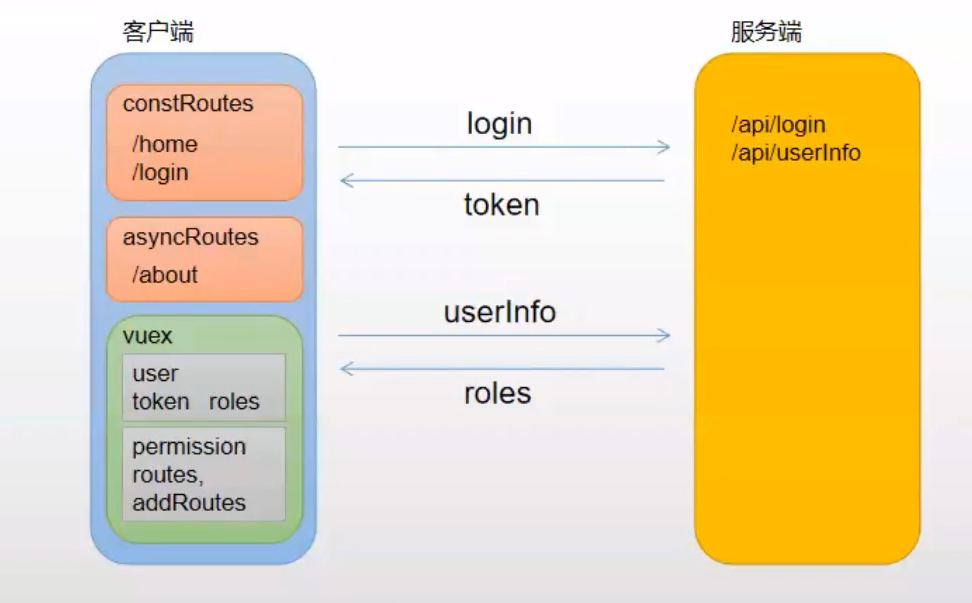

## vue.js项目中的一些最佳实践
**学习目标**
- 项目配置 
  - vue.config.js
- 权限控制
  - 路由权限,异步加载路由，按钮控制权限
  - 按钮显示权限 自定义指令或v-if
  - 导航菜单控制,tree组件，递归
  - 面包屑
- 数据交互
  - mock数据
  - 鉴权

### 项目配置
- 老项目`npm run eject // 项目打散，弹出来`

#### vue.confin.js 配置文件
- [官方文档vue.config.js文档](https://cli.vuejs.org/zh/config/#vue-config-js)
``` js
// vue.config.js
const prot = 7070;
const title = 'Vue 最佳实践';
module.exports = {
    publicPath: '/bast-preactice',// 部署应用包时的基本URL
    devServer:{
        prot
    },
    configureWebpack:{
        // 向index.html注入标题
        name: title
    }
}
//index.html
<title><%= webpackConfig.name %></title>
```

- 查看规则是否生效
  - vue inspect --rule vue

- 配置svg-loader

### 权限控制

